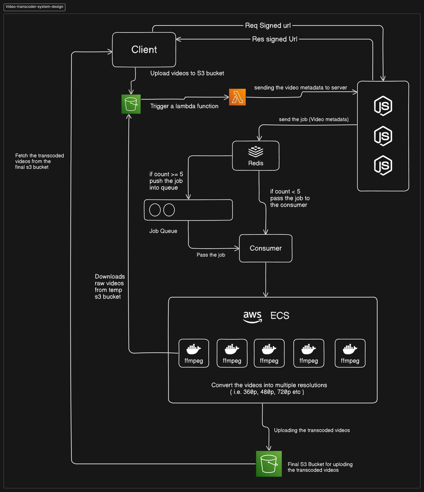

# Video Transcoding System

This project implements a distributed video transcoding system with a leaky bucket rate-limiting mechanism using Node.js, AWS services, Redis, and ffmpeg, aimed at automatically generating multiple resolutions of uploaded videos. It enhances accessibility and optimizes viewing experiences by providing users with options to preview and download videos in various resolutions.

## Project Demo

## Table of Contents
- [Architecture](#architecture)
- [Tech Stack](#tech-stack)
- [Setup Instructions](#setup-instructions)
- [How It Works](#how-it-works)
- [Environment Variables](#environment-variables)
- [Endpoints](#endpoints)
- [Improvements](#improvements)

## Architecture

## Technologies Used

- **AWS Services**: S3, Lambda, EventBridge, ECS
- **Frontend**: Next.js
- **Backend**: Node.js (with Express.js)
- **Database**: MongoDB, Redis
- **Docker**
- **Serverless Framework**

## Project Structure

The project is organized into several components:

- **ecs-task**: Manages the transcoding process by spinning up Docker containers on ECS.
- **upload-trigger-api**: AWS Lambda function triggered by S3 events, initiates video transcoding tasks.
- **video-transcoder-client**: Next.js frontend for uploading videos, previewing transcoded videos, and downloading transcoded files.
- **video-transcoder-server**: Main server implemented as a Lambda function using the Serverless Framework, handles video transcoding job queue management, rate limiting, and webhook calls.

## Features

- Automatically transcodes uploaded videos into multiple resolutions (360p, 480p, 720p, 1080p).
- Rate limiting to ensure a maximum of 5 concurrent video transcoding jobs.
- Integration with MongoDB for storing video metadata and status.
- Utilizes signed URLs for secure uploads and downloads from S3.
- Leverages AWS EventBridge for triggering transcoding tasks upon video upload events.

## Key Features
- **AWS Integration**: Utilizes AWS services like S3 for storage, Lambda for serverless computing, EventBridge for event-driven architecture, ECS for container orchestration, and MongoDB for database management.
- **Dockerized Video Transcoding**: Leverages Docker containers for efficient and scalable video transcoding tasks.
- **Event-Driven Architecture**: Initiates video transcoding tasks automatically upon video upload using S3 events and triggers further processing using EventBridge and Lambda functions.
- **Rate Limiting**: Implements rate limiting using a leaky bucket strategy to ensure efficient resource utilization and prevent overload.
- **Queue Management with Redis**: Utilizes Redis for queuing video transcoding jobs, ensuring efficient task management and scalability.
- **Webhook Notifications**: Sends webhook notifications upon completion or failure of video transcoding tasks, facilitating real-time updates.
- **Next.js Frontend**: Provides a user-friendly frontend interface for seamless video upload, preview, and download functionalities.

## Getting Started

To get started with the project, follow these steps:

1. Clone the repository: `git clone <repository-url>`
2. Install dependencies for each component (frontend, backend, ECS task).
3. Configure environment variables for AWS services, MongoDB, and other settings.
4. Deploy the backend components (Lambda functions, ECS task) using the provided scripts or Serverless Framework.
5. Launch the frontend application and start uploading and transcoding videos.

## How to Run
1. **Setup AWS Services**: Configure AWS S3 buckets, Lambda functions, ECS clusters, and EventBridge rules as per the provided configuration.
2. **Deploy Backend**: Deploy the serverless backend using the Serverless Framework.
3. **Build and Deploy Frontend**: Build the Next.js frontend and deploy it to a suitable hosting platform.
4. **Configure Environment Variables**: Set up environment variables for AWS credentials, S3 bucket names, webhook URLs, etc.
5. **Run the System**: Start the system and verify functionality by uploading videos, monitoring transcoding tasks, and accessing transcoded files.

## Usage

- Upload videos through the frontend interface.
- Preview transcoded videos in various resolutions.
- Download transcoded files individually or as a zip archive.

## Contribution Guidelines

Contributions to the project are welcome! If you have any suggestions, bug fixes, or feature implementations, please open an issue or submit a pull request following our contribution guidelines.
<!-- 
## License

This project is licensed under the [MIT License](LICENSE). -->
